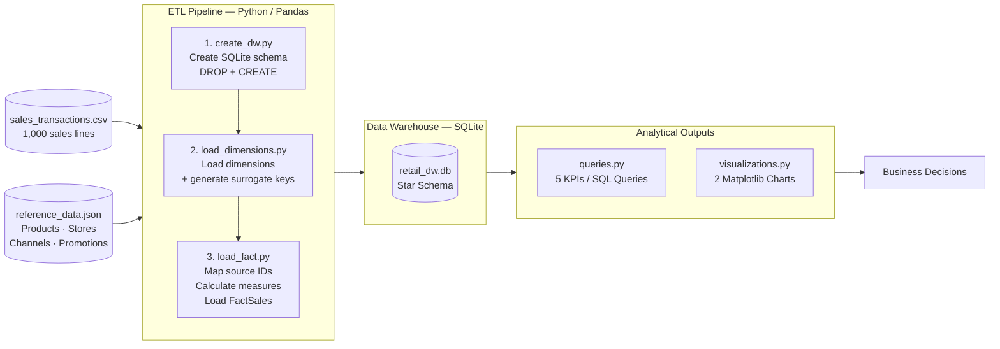
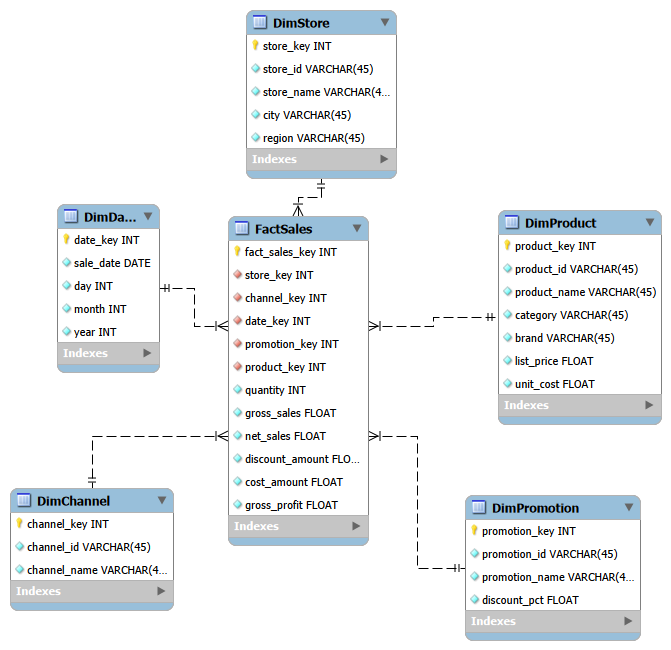
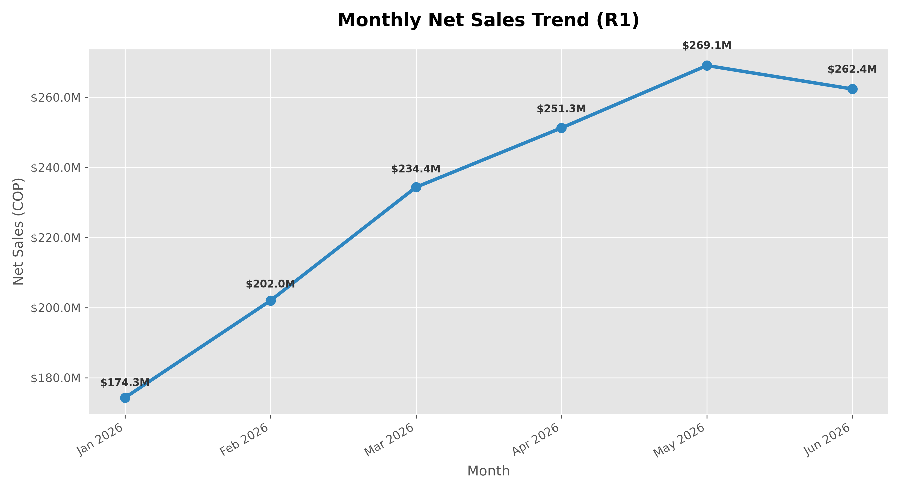
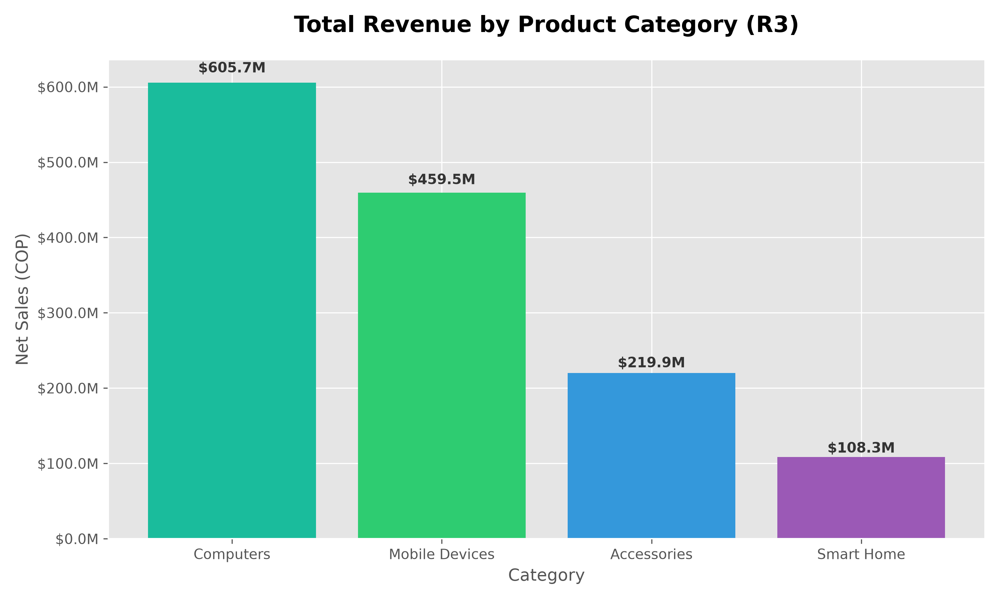

# Dimensional Data Warehouse — Omnichannel Retail

This project implements a dimensional Data Warehouse to consolidate six months of sales transactions from a retail company that operates two physical stores and one national online store. The goal is to organize the data into a Star Schema model that supports recurring analytical queries and future business dashboards.

---

## 1. Project Objective and Business Scenario

**Scenario:** A retail technology company operates two physical stores (Cali Centro and Bogota Norte) and one national online store (Online Colombia). Management wants to consolidate six months of sales data (January–June 2026) into a Data Warehouse to answer recurring analytical questions.

**Objective:** Translate business requirements into a correctly implemented dimensional model in SQLite, loaded with a reproducible ETL pipeline and validated through SQL queries and analytical visualizations.

---

## 2. Business Requirements

| ID | Business Requirement |
|----|----------------------|
| **R1** | Monitor **monthly net sales trends** and identify periods of growth or decline. |
| **R2** | Compare sales performance across **stores and sales channels** over time. |
| **R3** | Identify the best-performing **product categories and brands** by revenue and units sold. |
| **R4** | Evaluate **promotion performance** by comparing sales, units, and discounts across promotion types. |
| **R5** | Analyze **gross profit and gross margin** by product category, store, and month. |

---

## 3. Requirements Traceability

| Requirement | Analytical Question | Required Data | Expected KPI / Query |
|-------------|--------------------|--------------|-----------------------|
| R1 | How do net sales evolve month by month? | `net_sales`, date (year, month) | Sum of `net_sales` grouped by year and month |
| R2 | Which store and channel generate the most sales? | `net_sales`, store, channel | Sum of `net_sales` grouped by store and channel |
| R3 | Which category and brand sell the most by revenue and units? | `net_sales`, `quantity`, category, brand | Sum of `net_sales` and `quantity` grouped by category and brand |
| R4 | Which promotion drives the most sales, units, and discounts? | `net_sales`, `quantity`, `discount_amount`, promotion | Sum of all three metrics grouped by promotion type |
| R5 | What is the gross profit and margin by category, store, and month? | `gross_profit`, `net_sales`, category, store, month | Sum of `gross_profit` and ratio `gross_profit / net_sales × 100` |

---

## 4. System Architecture / Pipeline



---

## 5. Dimensional Model

### 5.1 Business Process

**Consolidation of omnichannel retail sales transactions** (physical stores and online).

### 5.2 Declared Grain

> **One row in `FactSales` represents a single individual sales line of a transaction** (equivalent to one record in `sales_transactions.csv`).

### 5.3 Star Schema Diagram



### 5.4 Design Justification

The model was designed exclusively from the five business requirements following Kimball's four-step process:

- **DimDate** → required by R1 (monthly trend), R2 (evolution over time), R5 (analysis by month).
- **DimStore** → required by R2 (compare stores), R5 (margin by store).
- **DimChannel** → required by R2 (compare sales channels).
- **DimProduct** → required by R3 (category and brand), R5 (margin by category).
- **DimPromotion** → required by R4 (promotion evaluation).

No additional dimensions were created because no requirement justified them.

---

## 6. Dimensions, Facts, and Measures

### Dimensions

| Table | Surrogate Key | Main Attributes | Justification |
|-------|--------------|-----------------|---------------|
| `DimDate` | `date_key` (INTEGER PK) | `sale_date`, `day`, `month`, `year` | R1, R2, R5 — temporal analysis |
| `DimProduct` | `product_key` (INTEGER PK) | `product_id`, `product_name`, `category`, `brand`, `list_price`, `unit_cost` | R3, R5 — analysis by category and brand |
| `DimStore` | `store_key` (INTEGER PK) | `store_id`, `store_name`, `city`, `region` | R2, R5 — analysis by store |
| `DimChannel` | `channel_key` (INTEGER PK) | `channel_id`, `channel_name` | R2 — channel comparison |
| `DimPromotion` | `promotion_key` (INTEGER PK) | `promotion_id`, `promotion_name`, `discount_pct` | R4 — promotion evaluation |

### Fact Table — `FactSales`

| Column | Type | Description |
|--------|------|-------------|
| `fact_sales_key` | INTEGER PK | Row surrogate key |
| `date_key` | INTEGER FK | → `DimDate` |
| `product_key` | INTEGER FK | → `DimProduct` |
| `store_key` | INTEGER FK | → `DimStore` |
| `channel_key` | INTEGER FK | → `DimChannel` |
| `promotion_key` | INTEGER FK | → `DimPromotion` |
| `quantity` | INTEGER | Units sold |
| `gross_sales` | REAL | Gross sales (`quantity × list_price`) |
| `net_sales` | REAL | Net sales (`quantity × unit_price_sale`) |
| `discount_amount` | REAL | Discount amount (`gross_sales − net_sales`) |
| `cost_amount` | REAL | Cost of the sale (`quantity × unit_cost`) |
| `gross_profit` | REAL | Gross profit (`net_sales − cost_amount`) |

### Measures and Calculations

| Measure | Calculation | Justification |
|---------|-------------|---------------|
| `quantity` | Taken directly from the source | R3, R4 — units sold |
| `gross_sales` | `quantity × list_price` | Base to calculate the discount (R4) |
| `net_sales` | `quantity × unit_price_sale` | R1, R2, R3, R4 — actual revenue received |
| `discount_amount` | `gross_sales − net_sales` | R4 — economic impact of the promotion |
| `cost_amount` | `quantity × unit_cost` | R5 — base to calculate profit |
| `gross_profit` | `net_sales − cost_amount` | R5 — gross profit |
| `gross_margin_%` | `gross_profit / net_sales × 100` | R5 — calculated at query time, not stored |

> **Note:** Gross margin percentage is not stored in `FactSales` because percentages are not additive. Direct aggregation would produce incorrect results; it must be calculated at query time over already-aggregated totals.

---

## 7. Load Order and Surrogate Key Strategy

### Load Order

```
1. create_dw.py        →  Drop and recreate the schema (DROP + CREATE TABLE)
2. load_dimensions.py  →  Load all 5 dimensions; SQLite auto-generates surrogate keys
3. load_fact.py        →  Map source IDs → surrogate keys, calculate measures, load FactSales
```

Dimensions must always be loaded **before** `FactSales` because the foreign keys in the fact table reference the primary keys of the dimension tables.

### Surrogate Key Strategy

- All dimensions use `INTEGER PRIMARY KEY` in SQLite, which automatically generates sequential integer values (surrogate keys) without requiring explicit sequences.
- Original business identifiers (`product_id`, `store_id`, etc.) are kept as attributes in the dimensions to enable traceability back to the source files.
- In `load_fact.py`, source IDs from the CSV are mapped to their surrogate keys via `pandas.merge()` before inserting into `FactSales`.
- `create_dw.py` runs `DROP TABLE IF EXISTS` at the start of every execution, guaranteeing **pipeline idempotency**: running it multiple times always produces exactly 1,000 rows in `FactSales` with no duplicates.

---

## 8. Execution Instructions

### Prerequisites
- Python 3.8+

### Steps

```bash
# 1. Clone the repository
git clone <repository-url>
cd lab2-dimensional-dw

# 2. Install dependencies
pip install -r requirements.txt

# 3. Run the full pipeline
#    (creates DB, loads dimensions, loads facts, generates visualizations)
python src/main.py

# 4. (Optional) Explore KPIs interactively
python src/queries.py
```

> The pipeline is **idempotent**: running `python src/main.py` multiple times always produces exactly 1,000 rows in `FactSales`.

---

## 9. SQL Queries / KPIs per Business Requirement

### R1 — Monthly Net Sales Trend

```sql
SELECT
    d.year           AS Year,
    d.month          AS Month,
    SUM(f.net_sales) AS Net_Sales
FROM FactSales f
JOIN DimDate d ON f.date_key = d.date_key
GROUP BY d.year, d.month
ORDER BY d.year, d.month;
```

| Year | Month | Net Sales (COP) |
|------|-------|-----------------|
| 2026 | 1 | 174,317,400 |
| 2026 | 2 | 202,010,000 |
| 2026 | 3 | 234,355,400 |
| 2026 | 4 | 251,270,000 |
| 2026 | 5 | 269,076,300 |
| 2026 | 6 | 262,383,300 |

---

### R2 — Sales by Store and Channel

```sql
SELECT
    s.store_name     AS Store,
    c.channel_name   AS Channel,
    SUM(f.net_sales) AS Net_Sales
FROM FactSales f
JOIN DimStore   s ON f.store_key   = s.store_key
JOIN DimChannel c ON f.channel_key = c.channel_key
GROUP BY s.store_name, c.channel_name
ORDER BY Net_Sales DESC;
```

| Store | Channel | Net Sales (COP) |
|-------|---------|-----------------|
| Bogota Norte | Physical Store | 500,482,400 |
| Online Colombia | Online | 475,517,000 |
| Cali Centro | Physical Store | 417,413,000 |

---

### R3 — Top-Performing Categories and Brands

```sql
SELECT
    p.category       AS Category,
    p.brand          AS Brand,
    SUM(f.net_sales) AS Revenue,
    SUM(f.quantity)  AS Units_Sold
FROM FactSales f
JOIN DimProduct p ON f.product_key = p.product_key
GROUP BY p.category, p.brand
ORDER BY Revenue DESC;
```

| Category | Brand | Revenue (COP) | Units Sold |
|----------|-------|---------------|-----------|
| Computers | NovaTech | 250,992,500 | 85 |
| Mobile Devices | NovaTech | 203,870,100 | 131 |
| Computers | Orion | 153,460,900 | 39 |
| Computers | Pulse | 122,180,700 | 54 |
| Mobile Devices | Orion | 110,307,400 | 87 |

---

### R4 — Promotion Performance

```sql
SELECT
    pr.promotion_name      AS Promotion,
    SUM(f.net_sales)       AS Sales,
    SUM(f.quantity)        AS Units,
    SUM(f.discount_amount) AS Discount_Amount
FROM FactSales f
JOIN DimPromotion pr ON f.promotion_key = pr.promotion_key
GROUP BY pr.promotion_name
ORDER BY Sales DESC;
```

| Promotion | Sales (COP) | Units | Discount (COP) |
|-----------|------------|-------|----------------|
| No Promotion | 922,274,800 | 1,048 | 725,200 |
| Seasonal 10% | 226,343,400 | 377 | 25,546,600 |
| Online 15% | 196,918,400 | 231 | 34,151,600 |
| Clearance 20% | 47,875,800 | 89 | 11,994,200 |

---

### R5 — Gross Profit and Gross Margin by Category, Store, and Month

```sql
SELECT
    p.category          AS Category,
    s.store_name        AS Store,
    d.month             AS Month,
    SUM(f.gross_profit) AS Gross_Profit,
    ROUND((SUM(f.gross_profit) / SUM(f.net_sales)) * 100, 2) AS Gross_Margin_Pct
FROM FactSales f
JOIN DimProduct p ON f.product_key = p.product_key
JOIN DimStore   s ON f.store_key   = s.store_key
JOIN DimDate    d ON f.date_key    = d.date_key
GROUP BY p.category, s.store_name, d.month
ORDER BY d.month, s.store_name, p.category;
```

| Category | Store | Month | Gross Profit (COP) | Margin % |
|----------|-------|-------|--------------------|----------|
| Accessories | Bogota Norte | 1 | 5,577,100 | 49.96% |
| Computers | Bogota Norte | 1 | 4,902,900 | 17.67% |
| Mobile Devices | Bogota Norte | 1 | 4,580,700 | 24.02% |
| Smart Home | Bogota Norte | 1 | 2,098,200 | 48.78% |

---

## 10. Analytical Visualizations

### Visualization 1 — Monthly Net Sales Trend (R1)



**Interpretation:** Net sales show a **sustained growth trend** throughout the first half of 2026. The minimum value is recorded in January (≈ \$174M COP) and the peak in May (≈ \$269M COP), representing a **54% increase over five months**. The slight dip in June (≈ \$262M) may indicate the onset of a seasonal slowdown at the end of the semester. This positive trend supports the continuation of the current commercial strategy.

---

### Visualization 2 — Total Revenue by Product Category (R3)



**Interpretation:** The **Computers** category leads by a wide margin in total revenue, followed by **Mobile Devices**. In contrast, **Accessories** achieves the **highest gross margin percentage** (≈ 50%), compared to Computers (≈ 15–18%). This contrast between revenue volume and profitability is key for portfolio decisions: Computers generates more cash, but Accessories is proportionally more profitable per unit sold.

---

## 11. Final Reflection

**How did the business requirements influence the dimensional model?**
The five requirements precisely dictated which dimensions to create (Date, Store, Channel, Product, Promotion) and which measures to store in the fact table. Without the requirements, it would have been tempting to copy all fields from the source files into the DW, creating a model with no clear analytical purpose. The requirements also prevented the creation of unnecessary tables.

**What would be the impact of choosing an incorrect granularity?**
If the data had been aggregated by day or by store instead of by individual sales line, it would have been impossible to analyze the impact of a specific promotion on a particular product, or to calculate the exact gross margin per item sold. Granularity at the sales line level preserves maximum analytical flexibility.

**Does the final model contain any unnecessary tables or attributes?**
Operational attributes that did not contribute to the analysis were excluded (e.g., `sale_line_id`, `transaction_id`). `list_price` and `unit_cost` were kept in `DimProduct` because they are needed to calculate the required financial measures. `gross_margin_%` is not stored in `FactSales` because percentages are not additive and must be calculated at query time over already-aggregated totals to produce correct results.
