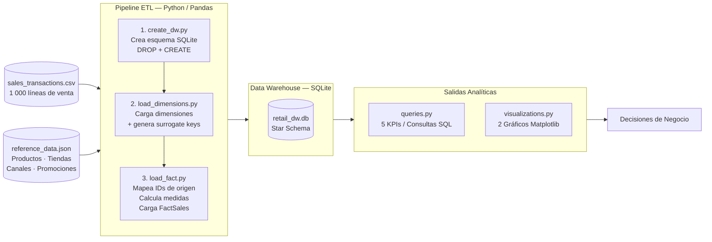

# Data Warehouse Dimensional — Retail Omnicanal

Este proyecto implementa un Data Warehouse dimensional para consolidar seis meses de transacciones de ventas de una empresa minorista que opera dos tiendas físicas y una tienda nacional en línea. El objetivo es organizar los datos en un modelo de esquema en estrella (Star Schema) que soporte consultas analíticas recurrentes y futuros dashboards de negocio.

---

## 1. Objetivo del Proyecto y Escenario de Negocio

**Escenario:** Una empresa de tecnología para el comercio minorista opera dos tiendas físicas (Cali Centro y Bogotá Norte) y una tienda nacional en línea (Online Colombia). La gerencia desea consolidar seis meses de información de ventas (enero–junio 2026) en un Data Warehouse para responder preguntas analíticas recurrentes.

**Objetivo:** Traducir los requisitos de negocio en un modelo dimensional correctamente implementado en SQLite, cargado con un pipeline ETL reproducible y validado mediante consultas SQL y visualizaciones analíticas.

---

## 2. Requisitos de Negocio

| ID | Requisito de negocio |
|----|----------------------|
| **R1** | Monitorear las **tendencias mensuales de ventas netas** e identificar períodos de crecimiento o disminución. |
| **R2** | Comparar el desempeño de las ventas entre **tiendas y canales** de venta a lo largo del tiempo. |
| **R3** | Identificar las **categorías de productos y marcas** con mejor desempeño utilizando ingresos y unidades vendidas. |
| **R4** | Evaluar el desempeño de las **promociones** comparando ventas, unidades y descuentos entre tipos de promoción. |
| **R5** | Analizar la **utilidad bruta y el margen bruto** por categoría de producto, tienda y mes. |

---

## 3. Trazabilidad de Requisitos

| Requisito | Pregunta analítica | Datos requeridos | KPI / Consulta esperada |
|-----------|-------------------|------------------|------------------------|
| R1 | ¿Cómo evolucionan las ventas netas mes a mes? | `net_sales`, fecha (año, mes) | Suma de `net_sales` agrupada por año y mes |
| R2 | ¿Qué tienda y canal generan más ventas? | `net_sales`, tienda, canal | Suma de `net_sales` agrupada por tienda y canal |
| R3 | ¿Qué categoría y marca venden más en ingresos y unidades? | `net_sales`, `quantity`, categoría, marca | Suma de `net_sales` y `quantity` agrupada por categoría y marca |
| R4 | ¿Qué promoción genera más ventas, unidades y descuentos? | `net_sales`, `quantity`, `discount_amount`, promoción | Suma de las tres métricas agrupada por tipo de promoción |
| R5 | ¿Cuál es la utilidad bruta y el margen por categoría, tienda y mes? | `gross_profit`, `net_sales`, categoría, tienda, mes | Suma de `gross_profit` y ratio `gross_profit / net_sales × 100` |

---

## 4. Arquitectura del Sistema / Pipeline



---

## 5. Modelo Dimensional

### 5.1 Proceso de Negocio

**Consolidación de transacciones de ventas minoristas omnicanal** (tiendas físicas y online).

### 5.2 Granularidad declarada

> **Una fila en `FactSales` representa una única línea de venta individual de una transacción** (equivalente a un registro en `sales_transactions.csv`).

### 5.3 Diagrama Star Schema


### 5.4 Justificación del diseño

El modelo fue diseñado exclusivamente a partir de los cinco requisitos de negocio siguiendo el proceso de cuatro pasos de Kimball:

- **DimDate** → requerida por R1 (tendencia mensual), R2 (evolución en el tiempo), R5 (análisis por mes).
- **DimStore** → requerida por R2 (comparar tiendas), R5 (margen por tienda).
- **DimChannel** → requerida por R2 (comparar canales de venta).
- **DimProduct** → requerida por R3 (categoría y marca), R5 (margen por categoría).
- **DimPromotion** → requerida por R4 (evaluación de promociones).

No se crearon dimensiones adicionales porque ningún requisito las justificaba.

---

## 6. Descripción de Dimensiones, Hechos y Medidas

### Dimensiones

| Tabla | Surrogate Key | Atributos principales | Justificación |
|-------|--------------|----------------------|---------------|
| `DimDate` | `date_key` (INTEGER PK) | `sale_date`, `day`, `month`, `year` | R1, R2, R5 — análisis temporal |
| `DimProduct` | `product_key` (INTEGER PK) | `product_id`, `product_name`, `category`, `brand`, `list_price`, `unit_cost` | R3, R5 — análisis por categoría y marca |
| `DimStore` | `store_key` (INTEGER PK) | `store_id`, `store_name`, `city`, `region` | R2, R5 — análisis por tienda |
| `DimChannel` | `channel_key` (INTEGER PK) | `channel_id`, `channel_name` | R2 — comparación por canal |
| `DimPromotion` | `promotion_key` (INTEGER PK) | `promotion_id`, `promotion_name`, `discount_pct` | R4 — evaluación de promociones |

### Tabla de Hechos — `FactSales`

| Columna | Tipo | Descripción |
|---------|------|-------------|
| `fact_sales_key` | INTEGER PK | Surrogate key de la fila |
| `date_key` | INTEGER FK | → `DimDate` |
| `product_key` | INTEGER FK | → `DimProduct` |
| `store_key` | INTEGER FK | → `DimStore` |
| `channel_key` | INTEGER FK | → `DimChannel` |
| `promotion_key` | INTEGER FK | → `DimPromotion` |
| `quantity` | INTEGER | Unidades vendidas |
| `gross_sales` | REAL | Venta bruta (`quantity × list_price`) |
| `net_sales` | REAL | Venta neta (`quantity × unit_price_sale`) |
| `discount_amount` | REAL | Monto descontado (`gross_sales − net_sales`) |
| `cost_amount` | REAL | Costo de la venta (`quantity × unit_cost`) |
| `gross_profit` | REAL | Utilidad bruta (`net_sales − cost_amount`) |

### Medidas y Cálculos

| Medida | Cálculo | Justificación |
|--------|---------|---------------|
| `quantity` | Tomado directamente de la fuente | R3, R4 — unidades vendidas |
| `gross_sales` | `quantity × list_price` | Base para calcular el descuento (R4) |
| `net_sales` | `quantity × unit_price_sale` | R1, R2, R3, R4 — ingreso real recibido |
| `discount_amount` | `gross_sales − net_sales` | R4 — impacto económico de la promoción |
| `cost_amount` | `quantity × unit_cost` | R5 — base para calcular la utilidad |
| `gross_profit` | `net_sales − cost_amount` | R5 — utilidad bruta |
| `gross_margin_%` | `gross_profit / net_sales × 100` | R5 — calculado en consulta, no almacenado |

> **Nota:** El margen bruto porcentual no se almacena en `FactSales` porque los porcentajes no son aditivos. Su agregación directa produciría resultados incorrectos; debe calcularse en el momento de la consulta sobre los totales ya agregados.

---

## 7. Orden de Carga y Estrategia de Claves Sustitutas

### Orden de carga

```
1. create_dw.py        →  Elimina y recrea el esquema (DROP + CREATE TABLE)
2. load_dimensions.py  →  Carga las 5 dimensiones; SQLite genera surrogate keys automáticamente
3. load_fact.py        →  Mapea IDs de origen → surrogate keys, calcula medidas, carga FactSales
```

Las dimensiones deben cargarse **siempre antes** que `FactSales` porque las claves foráneas de la tabla de hechos referencian las claves primarias de las dimensiones.

### Estrategia de claves sustitutas

- Todas las dimensiones usan `INTEGER PRIMARY KEY` en SQLite, que genera automáticamente valores enteros secuenciales (surrogate keys) sin necesidad de secuencias explícitas.
- Los identificadores de negocio originales (`product_id`, `store_id`, etc.) se conservan como atributos en las dimensiones para facilitar la trazabilidad hacia las fuentes.
- En `load_fact.py`, los IDs de origen del CSV se mapean a sus surrogate keys mediante `pandas.merge()` antes de insertar en `FactSales`.
- El script `create_dw.py` ejecuta `DROP TABLE IF EXISTS` al inicio de cada corrida, garantizando la **idempotencia del pipeline**: ejecutarlo múltiples veces produce siempre exactamente 1 000 filas sin duplicados.

---

## 8. Instrucciones de Ejecución

### Requisitos previos
- Python 3.8+

### Pasos

```bash
# 1. Clonar el repositorio
git clone <url-del-repositorio>
cd lab2-dimensional-dw

# 2. Instalar dependencias
pip install -r requirements.txt

# 3. Ejecutar el pipeline completo
#    (crea DB, carga dimensiones, carga hechos, genera visualizaciones)
python src/main.py

# 4. (Opcional) Explorar los KPIs de forma interactiva
python src/queries.py
```

> El pipeline es **idempotente**: se puede ejecutar `python src/main.py` múltiples veces y siempre producirá exactamente 1 000 filas en `FactSales`.

---

## 9. Consultas SQL / KPI por Requisito de Negocio

### R1 — Tendencia mensual de ventas netas

```sql
SELECT
    d.year           AS Año,
    d.month          AS Mes,
    SUM(f.net_sales) AS Ventas_Netas
FROM FactSales f
JOIN DimDate d ON f.date_key = d.date_key
GROUP BY d.year, d.month
ORDER BY d.year, d.month;
```

| Año | Mes | Ventas Netas (COP) |
|-----|-----|--------------------|
| 2026 | 1 | 174.317.400 |
| 2026 | 2 | 202.010.000 |
| 2026 | 3 | 234.355.400 |
| 2026 | 4 | 251.270.000 |
| 2026 | 5 | 269.076.300 |
| 2026 | 6 | 262.383.300 |

---

### R2 — Ventas por tienda y canal

```sql
SELECT
    s.store_name     AS Tienda,
    c.channel_name   AS Canal,
    SUM(f.net_sales) AS Ventas_Netas
FROM FactSales f
JOIN DimStore   s ON f.store_key   = s.store_key
JOIN DimChannel c ON f.channel_key = c.channel_key
GROUP BY s.store_name, c.channel_name
ORDER BY Ventas_Netas DESC;
```

| Tienda | Canal | Ventas Netas (COP) |
|--------|-------|-------------------|
| Bogota Norte | Physical Store | 500.482.400 |
| Online Colombia | Online | 475.517.000 |
| Cali Centro | Physical Store | 417.413.000 |

---

### R3 — Categorías y marcas con mejor desempeño

```sql
SELECT
    p.category       AS Categoría,
    p.brand          AS Marca,
    SUM(f.net_sales) AS Ingresos,
    SUM(f.quantity)  AS Unidades_Vendidas
FROM FactSales f
JOIN DimProduct p ON f.product_key = p.product_key
GROUP BY p.category, p.brand
ORDER BY Ingresos DESC;
```

| Categoría | Marca | Ingresos (COP) | Unidades |
|-----------|-------|----------------|----------|
| Computers | NovaTech | 250.992.500 | 85 |
| Mobile Devices | NovaTech | 203.870.100 | 131 |
| Computers | Orion | 153.460.900 | 39 |
| Computers | Pulse | 122.180.700 | 54 |
| Mobile Devices | Orion | 110.307.400 | 87 |

---

### R4 — Evaluación del desempeño de las promociones

```sql
SELECT
    pr.promotion_name      AS Promoción,
    SUM(f.net_sales)       AS Ventas,
    SUM(f.quantity)        AS Unidades,
    SUM(f.discount_amount) AS Monto_Descuento
FROM FactSales f
JOIN DimPromotion pr ON f.promotion_key = pr.promotion_key
GROUP BY pr.promotion_name
ORDER BY Ventas DESC;
```

| Promoción | Ventas (COP) | Unidades | Descuento (COP) |
|-----------|-------------|----------|-----------------|
| No Promotion | 922.274.800 | 1.048 | 725.200 |
| Seasonal 10% | 226.343.400 | 377 | 25.546.600 |
| Online 15% | 196.918.400 | 231 | 34.151.600 |
| Clearance 20% | 47.875.800 | 89 | 11.994.200 |

---

### R5 — Utilidad bruta y margen bruto por categoría, tienda y mes

```sql
SELECT
    p.category          AS Categoría,
    s.store_name        AS Tienda,
    d.month             AS Mes,
    SUM(f.gross_profit) AS Utilidad_Bruta,
    ROUND((SUM(f.gross_profit) / SUM(f.net_sales)) * 100, 2) AS Margen_Bruto_Pct
FROM FactSales f
JOIN DimProduct p ON f.product_key = p.product_key
JOIN DimStore   s ON f.store_key   = s.store_key
JOIN DimDate    d ON f.date_key    = d.date_key
GROUP BY p.category, s.store_name, d.month
ORDER BY d.month, s.store_name, p.category;
```

| Categoría | Tienda | Mes | Utilidad Bruta (COP) | Margen % |
|-----------|--------|-----|----------------------|----------|
| Accessories | Bogota Norte | 1 | 5.577.100 | 49,96% |
| Computers | Bogota Norte | 1 | 4.902.900 | 17,67% |
| Mobile Devices | Bogota Norte | 1 | 4.580.700 | 24,02% |
| Smart Home | Bogota Norte | 1 | 2.098.200 | 48,78% |

---

## 10. Visualizaciones Analíticas

### Visualización 1 — Tendencia Mensual de Ventas Netas (R1)


**Interpretación:** Las ventas netas muestran una **tendencia de crecimiento sostenido** durante el primer semestre de 2026. Se registra el valor mínimo en enero (≈ $174M COP) y el máximo en mayo (≈ $269M COP), lo que representa un crecimiento del **54% en cinco meses**. La leve caída en junio (≈ $262M) puede indicar el inicio de una desaceleración estacional al cierre del semestre. Esta tendencia positiva respalda la continuidad de la estrategia comercial vigente.

---

### Visualización 2 — Ingresos Totales por Categoría de Producto (R3)


**Interpretación:** La categoría **Computers** lidera ampliamente en ingresos totales, seguida de **Mobile Devices**. Por el contrario, **Accessories** presenta el mayor margen bruto porcentual (≈ 50%), frente a Computers (≈ 15–18%). Este contraste entre volumen de ingresos y rentabilidad por categoría es clave para decisiones de portafolio: Computers genera más caja, pero Accessories es proporcionalmente más rentable por unidad vendida.

---

## 11. Reflexión Final

**¿Cómo influyeron los requisitos de negocio en el modelo dimensional?**
Los cinco requisitos dictaron con precisión qué dimensiones crear (Fecha, Tienda, Canal, Producto, Promoción) y qué medidas almacenar en la tabla de hechos. Sin los requisitos, habría sido tentador copiar todos los campos de las fuentes al DW, creando un modelo sin propósito analítico claro. Los requisitos también evitaron la creación de tablas innecesarias.

**¿Cuál sería el impacto de elegir una granularidad incorrecta?**
Si se hubieran agrupado los datos por día o por tienda en lugar de por línea de venta individual, sería imposible analizar el impacto de una promoción específica en un producto concreto, ni calcular el margen bruto exacto por artículo vendido. La granularidad a nivel de línea de venta preserva la máxima flexibilidad analítica.

**¿El modelo final contiene tablas o atributos innecesarios?**
Se excluyeron atributos operativos que no aportaban al análisis (p. ej., `sale_line_id`, `transaction_id`). Se conservaron `list_price` y `unit_cost` en `DimProduct` porque son necesarios para calcular las medidas financieras requeridas. El `gross_margin_%` no se almacena en `FactSales` porque los porcentajes no son aditivos y deben calcularse en consulta sobre los totales ya agregados para producir resultados correctos.
